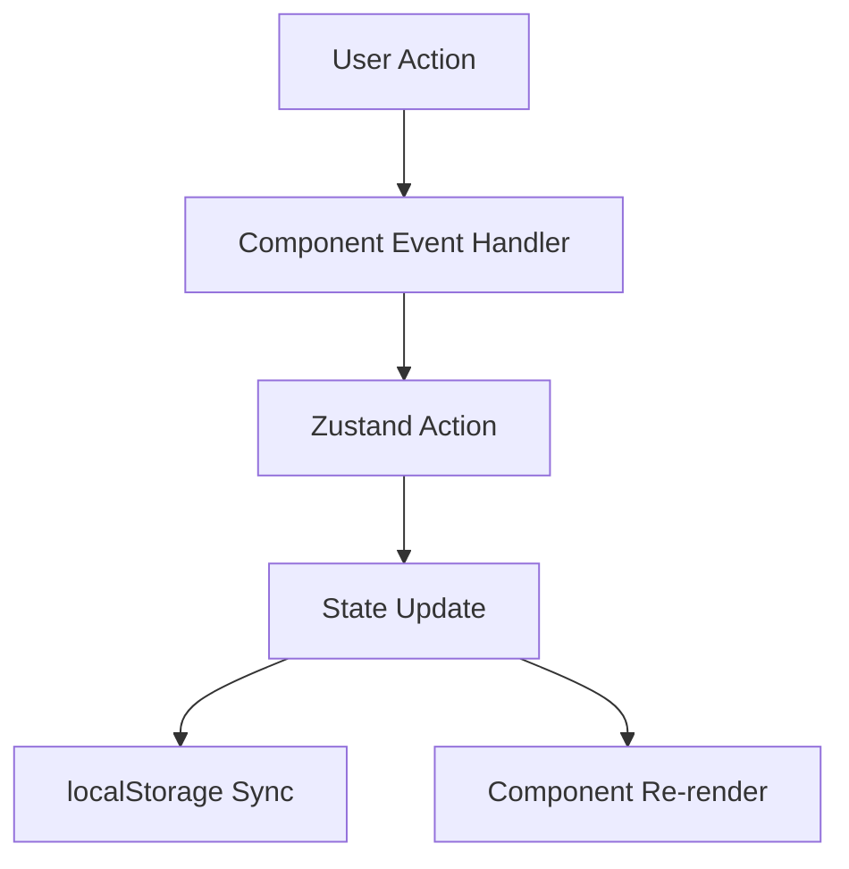

# Architecture Documentation - Sygill

## Overview

Sygill es una aplicación de página única (SPA) construida con Next.js App Router que funciona completamente en el cliente sin necesidad de un backend tradicional. La arquitectura prioriza la simplicidad, el rendimiento y la experiencia del usuario.

## Principios de Diseño

### 1. Client-First Architecture

- **Rationale**: Para un knowledge management personal, no se requiere servidor
- **Benefits**:
  - Cero latencia en operaciones
  - Funciona offline
  - Sin costos de backend
  - Privacy total (datos locales)

### 2. Component Composition

- **Pattern**: Componentes pequeños, enfocados y reutilizables
- **Benefits**:
  - Fácil testing
  - Reutilización
  - Mantenibilidad

### 3. Declarative State Management

- **Tool**: Zustand
- **Rationale**:
  - Menos boilerplate que Redux
  - No necesita Context Providers
  - TypeScript-first
  - Devtools integration

### 4. Progressive Enhancement

- **Features agregadas gradualmente**:
  - Core CRUD → Search → Study Mode → AI Chat
- **Benefits**: MVP rápido, iteración continua

## Arquitectura de Capas

```
┌─────────────────────────────────────────┐
│         Presentation Layer              │
│  (Components, UI, Animations)           │
├─────────────────────────────────────────┤
│         Business Logic Layer            │
│  (Hooks, Utils, Calculations)           │
├─────────────────────────────────────────┤
│         State Management Layer          │
│  (Zustand Store, Actions)               │
├─────────────────────────────────────────┤
│         Data Persistence Layer          │
│  (localStorage, JSON Import/Export)     │
└─────────────────────────────────────────┘
```

## Data Flow

### State Management (Zustand)

Zustand actúa como single source of truth para toda la aplicación.



**Ventajas**:

- Una sola dirección de flujo de datos
- Predictibilidad
- Fácil debugging
- Time-travel debugging con Zustand DevTools

### Component Communication

**Parent → Child**: Props

```typescript
<ConceptCard concept={concept} onClick={handleClick} />
```

**Child → Parent**: Callbacks

```typescript
<ConceptDetail onClose={handleClose} />
```

**Sibling → Sibling**: Zustand Store

```typescript
// Component A
const addConcept = useStore((state) => state.addConcept);

// Component B
const concepts = useStore((state) => state.concepts);
```

## Key Architectural Decisions

### 1. ¿Por qué Zustand en lugar de Context API?

**Context API**:

- ✅ Built-in React
- ❌ Re-renders todos los consumidores
- ❌ Requiere múltiples providers para optimización
- ❌ No tiene persistencia built-in

**Zustand**:

- ✅ Selective re-renders
- ✅ Single store, no providers
- ✅ Middleware para persistencia
- ✅ Devtools integration
- ✅ Menos boilerplate

### 2. ¿Por qué localStorage en lugar de IndexedDB?

**Para Sygill**:

- Volumen de datos bajo (~50-500 conceptos típicos)
- localStorage suficiente para ~5MB
- API síncrona más simple
- No requiere schemas

**IndexedDB sería mejor si**:

- Almacenamiento de imágenes/videos
- Miles de conceptos
- Queries complejas
- Offline-first sync

### 3. ¿Por qué Fuse.js para búsqueda?

**Alternativas consideradas**:

| Solución      | Pros                  | Contras                 | Decisión |
| ------------- | --------------------- | ----------------------- | -------- |
| Native filter | Simple                | No fuzzy, no ranking    | ❌       |
| RegEx         | Flexible              | Difícil mantener        | ❌       |
| Fuse.js       | Fuzzy, scoring, fácil | 8KB extra               | ✅       |
| Algolia       | Ultra rápido          | Requiere backend, costo | ❌       |

**Resultado**: Fuse.js ofrece el mejor balance para la escala de Sygill.

### 4. ¿Por qué Next.js App Router?

**Ventajas usadas**:

- File-based routing
- Built-in optimization (fonts, images)
- TypeScript first-class support
- Future-ready para SSR/SSG si se necesita

**Características no usadas (aún)**:

- Server Components
- Server Actions
- ISR/SSG

**Justificación**: Aunque actualmente es una SPA, Next.js permite migrar a SSR/SSG en el futuro sin reescribir.

## Performance Considerations

### Optimizaciones Implementadas

#### 1. Memoization

```typescript
// En page.tsx
const filteredConcepts = useMemo(() => {
  if (!searchQuery) return concepts;
  const fuse = new Fuse(concepts, options);
  return fuse.search(searchQuery).map((r) => r.item);
}, [concepts, searchQuery]);
```

**Impact**: Evita recalcular búsqueda en cada render.

#### 2. Lazy Loading

```typescript
// Componentes pesados cargados solo cuando se necesitan
const ConceptDetail; // Solo se carga cuando se abre un concepto
const FlashcardMode; // Solo se carga al iniciar estudio
```

#### 3. Framer Motion Layout Animations

```typescript
<AnimatePresence mode="wait">
  {/* Solo anima elementos visibles */}
</AnimatePresence>
```

**Tradeoff**: Animaciones suaves vs. performance en listas muy largas.

### Bottlenecks Potenciales

#### 1. Fuse.js con Datasets Grandes

**Problema**: Búsqueda puede ser lenta con >1000 conceptos

**Soluciones**:

- Implementar debouncing en input
- Mover búsqueda a Web Worker
- Paginar resultados

#### 2. Re-renders Innecesarios

**Problema**: Componentes re-renderean sin cambios

**Soluciones**:

```typescript
// Usar React.memo para componentes puros
const ConceptCard = React.memo(({ concept }) => {
  // ...
});

// Selectores específicos en Zustand
const mastered = useStore(
  (state) => state.concepts.filter((c) => c.mastered).length
);
```

#### 3. localStorage Sync

**Problema**: Write a localStorage en cada cambio

**Estado actual**: Zustand middleware maneja esto eficientemente

**Mejora futura**: Debounce writes

## Security Considerations

### Current Security Model

**Threat Model**:

- No authentication (personal use)
- No backend (no server attacks)
- Data solo en cliente

**Protecciones**:

1. **XSS Prevention**:

   - React escapa contenido por defecto
   - Syntax highlighter usa sanitización

2. **Code Injection**:

   - CodePen export usa API oficial
   - No eval() o Function() en código de usuario

3. **Data Validation**:

```typescript
// En import
const validateConcept = (data: any): data is Concept => {
  return (
    typeof data.id === 'string' &&
    typeof data.term === 'string' &&
    // ...
  )
}
```

### Future Security (Multi-user)

Para versión multi-usuario se necesitaría:

- Authentication (NextAuth.js)
- Authorization (RBAC)
- CSRF protection
- Rate limiting
- Input sanitization server-side

## Scalability Path

### Phase 1: Current (Local-only)

- ✅ localStorage
- ✅ Client-side only
- ✅ Single user

### Phase 2: Sync (Planned)

- [ ] Backend API (Next.js API routes)
- [ ] PostgreSQL/MongoDB
- [ ] Auth (NextAuth.js)
- [ ] Real-time sync

### Phase 3: Collaborative (Future)

- [ ] Multi-user workspaces
- [ ] Real-time collaboration (WebSockets)
- [ ] Permissions system
- [ ] Activity feed

### Phase 4: Scale (Long-term)

- [ ] Microservices
- [ ] CDN para assets
- [ ] Search service (Elasticsearch)
- [ ] Analytics pipeline

## Testing Strategy

### Testing Pyramid

```
        /\
       /  \     E2E Tests (10%)
      /----\    Integration Tests (30%)
     /------\   Unit Tests (60%)
    /--------\
```

### Test Coverage Goals

| Layer       | Tool                  | Coverage Target |
| ----------- | --------------------- | --------------- |
| Unit        | Jest                  | 80%             |
| Integration | React Testing Library | 70%             |
| E2E         | Playwright/Cypress    | Critical paths  |

### Critical Test Cases

1. **Store (useStore.ts)**

   - CRUD operations
   - Persistence to localStorage
   - Seeding logic

2. **Search**

   - Exact matches
   - Fuzzy matches
   - Empty results

3. **Flashcards**

   - Navigation
   - Progress tracking
   - Mastery toggling

4. **Data Import/Export**
   - Valid JSON import
   - Invalid JSON handling
   - Export format

## Monitoring & Debugging

### Current Tools

1. **React DevTools**: Component inspection
2. **Zustand DevTools**: State time-travel
3. **Next.js Dev Overlay**: Build errors
4. **Browser DevTools**: Network, Performance

### Recommended Production Monitoring

1. **Error Tracking**: Sentry
2. **Analytics**: Vercel Analytics / Plausible
3. **Performance**: Web Vitals
4. **Logging**: Console → LogRocket

## Dependencies Rationale

### Core Dependencies

| Package       | Size  | Reason     | Alternative      |
| ------------- | ----- | ---------- | ---------------- |
| next          | 250KB | Framework  | Create React App |
| react         | 40KB  | UI Library | Vue, Svelte      |
| zustand       | 3KB   | State      | Redux (45KB)     |
| framer-motion | 67KB  | Animations | CSS only         |
| fuse.js       | 8KB   | Search     | Native filter    |
| lucide-react  | ~50KB | Icons      | react-icons      |

### Trade-offs

**Framer Motion** (67KB):

- ✅ Smooth, physics-based animations
- ✅ Layout animations
- ❌ Large bundle size
- **Decision**: Keep - animations are core to UX

**react-syntax-highlighter** (~100KB):

- ✅ Syntax highlighting out-of-box
- ❌ Large bundle
- **Alternative**: Prism.js manual integration
- **Decision**: Keep - code highlighting is essential

## Future Architectural Changes

### Considerations for v2.0

1. **Server Components**

   - Reduce bundle size
   - SEO for public concepts

2. **Incremental Static Regeneration**

   - Fast initial load
   - Fresh data

3. **Edge Functions**

   - AI chat responses
   - Search API

4. **Database Migration**

   - PostgreSQL con Prisma
   - Full-text search

5. **Caching Strategy**
   - Redis para sessions
   - CDN para assets

---

**Last Updated**: November 2025
**Version**: 1.0.0
