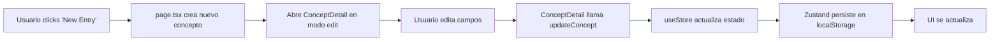
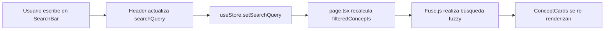
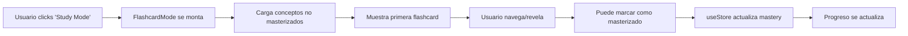

# Agents Documentation - Sygill

> **Sygill**: Un grimorio místico para dominar conceptos de programación

## Visión General

Sygill es una aplicación de gestión de conocimiento diseñada para ayudar a desarrolladores a organizar, estudiar y dominar conceptos de programación. Combina una estética mística con funcionalidad moderna para crear una experiencia de aprendizaje inmersiva.

## Arquitectura de Agentes

### 1. **Store Agent (Zustand)**

**Ubicación**: `store/useStore.ts`

El Store Agent es el corazón de la gestión de estado de la aplicación. Utiliza Zustand para proporcionar un estado global reactivo y persistente.

**Responsabilidades**:

- Gestión de conceptos (CRUD operations)
- Filtrado y búsqueda
- Persistencia local (localStorage)
- Seeding de base de datos

**API Principal**:

```typescript
interface StoreState {
  // Estado
  concepts: Concept[];
  searchQuery: string;
  filterCategory: string | null;
  filterMastered: boolean | null;
  filterFavorite: boolean | null;

  // Acciones de Conceptos
  addConcept: (data: ConceptFormData) => void;
  updateConcept: (id: string, data: Partial<Concept>) => void;
  deleteConcept: (id: string) => void;
  toggleMastery: (id: string) => void;
  toggleFavorite: (id: string) => void;

  // Acciones de Filtrado
  setSearchQuery: (query: string) => void;
  setFilterCategory: (category: string | null) => void;
  setFilterMastered: (mastered: boolean | null) => void;
  setFilterFavorite: (favorite: boolean | null) => void;

  // Utilidades
  seedDatabase: () => void;
  importConcepts: (concepts: Concept[]) => void;
  resetDatabase: () => void;
}
```

**Persistencia**:

- Los datos se persisten automáticamente en `localStorage` bajo la clave `"sygill-storage"`
- Se utiliza `zustand/middleware` para la serialización JSON

---

### 2. **Search Agent (Fuse.js)**

**Ubicación**: `app/page.tsx` (integrado)

El Search Agent proporciona búsqueda fuzzy (difusa) de alta calidad sobre los conceptos.

**Responsabilidades**:

- Búsqueda en múltiples campos (term, definition, category, notes)
- Scoring y ranking de resultados
- Búsqueda tolerante a errores tipográficos

**Configuración**:

```typescript
const fuse = new Fuse(concepts, {
  keys: ["term", "definition", "category", "notes"],
  threshold: 0.3, // 0.0 = exact match, 1.0 = match anything
});
```

**Campos de Búsqueda**:

1. `term` - Nombre del concepto
2. `definition` - Definición breve
3. `category` - Categoría/etiqueta
4. `notes` - Notas extensas

---

### 3. **AI Chat Agent**

**Ubicación**: `components/AIChatInterface.tsx`

El AI Chat Agent es una interfaz conversacional para interactuar con conceptos.

**Responsabilidades**:

- Interfaz de chat flotante
- Respuestas contextuales (simuladas)
- Integración futura con LLMs

**Estados**:

- Abierto/Cerrado
- Historial de mensajes
- Typing indicators

**Características Actuales**:

- UI de chat mystical-themed
- Botón flotante con animaciones
- Preparado para integración con APIs de AI

---

### 4. **Flashcard Study Agent**

**Ubicación**: `components/FlashcardMode.tsx`

El Flashcard Study Agent proporciona un modo de estudio interactivo basado en flashcards.

**Responsabilidades**:

- Presentación de conceptos en formato flashcard
- Sistema de navegación (anterior/siguiente)
- Revelación progresiva de información
- Seguimiento de progreso

**Características**:

- Vista frontal: Muestra el término y categoría
- Vista trasera: Revela definición, notas y código
- Progress indicator
- Navegación con teclado

**Flujo de Estudio**:

1. Usuario inicia modo estudio
2. Se cargan todos los conceptos no masterizados
3. Usuario navega con botones o teclado
4. Puede marcar conceptos como "masterizados"
5. Track de progreso actualizado en tiempo real

---

### 5. **Concept Detail Agent**

**Ubicación**: `components/ConceptDetail.tsx`

El Concept Detail Agent maneja la visualización y edición detallada de conceptos individuales.

**Responsabilidades**:

- Visualización completa de concepto
- Edición inline
- Sintaxis highlighting de código
- Exportación a CodePen
- Gestión de favoritos y mastery

**Modos**:

1. **Vista Mode**: Muestra información de solo lectura
2. **Edit Mode**: Permite edición inline de todos los campos

**Integraciones**:

- `react-syntax-highlighter` para código
- `lib/codepen.ts` para exportación
- Framer Motion para animaciones

**Acciones Disponibles**:

- Toggle favorite (⭐)
- Toggle mastered (✓)
- Edit (✏️)
- Delete (🗑️)
- Export to CodePen (</> - solo si hay código)

---

### 6. **Theme Agent**

**Ubicación**: `components/theme-provider.tsx`, `components/ThemeToggle.tsx`

El Theme Agent gestiona el tema visual de la aplicación (claro/oscuro).

**Responsabilidades**:

- Detección de preferencia del sistema
- Toggle manual de tema
- Persistencia de preferencia
- Sincronización con document class

**Estados**:

- `light`: Tema claro
- `dark`: Tema oscuro
- `system`: Usa preferencia del OS

---

### 7. **Seed Data Agent**

**Ubicación**: `lib/seed-data.ts`

El Seed Data Agent proporciona datos iniciales de alta calidad para nuevos usuarios.

**Responsabilidades**:

- Proporcionar ~50 conceptos predefinidos
- Cubrir múltiples categorías
- Ejemplos de código funcionales
- Contenido educativo en español

**Categorías Incluidas**:

- JavaScript
- React
- Next.js
- TypeScript
- CSS
- State Management
- Backend
- Security
- Database
- DevOps
- Testing
- Architecture
- Methodology

---

## Flujos de Datos Principales

### Flujo de Creación de Concepto



### Flujo de Búsqueda



### Flujo de Estudio (Flashcards)



---

## Tipos de Datos

### Concept

```typescript
interface Concept {
  id: string; // UUID único
  term: string; // Nombre del concepto
  category: string; // Categoría/tag
  definition: string; // Definición breve
  notes: string; // Notas extensas (soporta markdown)
  codeSnippet: string; // Código de ejemplo
  mastered: boolean; // ¿Usuario lo domina?
  favorite: boolean; // ¿Es favorito?
  createdAt: number; // Timestamp de creación
  updatedAt: number; // Timestamp de última actualización
}
```

---

## Configuración y Extensión

### Agregar Nueva Categoría

1. No requiere configuración - las categorías son dinámicas
2. Simplemente crea conceptos con el nuevo valor de `category`
3. Aparecerán automáticamente en los filtros

### Agregar Nuevo Campo a Concept

1. Actualizar `types/index.ts`:

```typescript
export interface Concept {
  // ... campos existentes
  newField: string;
}
```

2. Actualizar `ConceptDetail.tsx` para mostrar/editar el campo

3. Actualizar `seed-data.ts` para incluir el campo en ejemplos

4. Actualizar `useStore.ts` si necesita lógica especial

### Integrar AI Real

Actualmente `AIChatInterface.tsx` usa respuestas simuladas. Para integrar un LLM:

1. Instalar SDK del proveedor (OpenAI, Anthropic, etc.)
2. Crear API route en `app/api/chat/route.ts`
3. Actualizar `handleSendMessage` en `AIChatInterface.tsx`
4. Implementar streaming de respuestas
5. Añadir context de conceptos actuales

### Personalizar Tema

Los temas están definidos en `app/globals.css` usando CSS variables:

```css
@layer base {
  :root {
    --background: 0 0% 100%;
    --foreground: 222.2 84% 4.9%;
    /* ... más variables */
  }

  .dark {
    --background: 222.2 84% 4.9%;
    --foreground: 210 40% 98%;
    /* ... más variables */
  }
}
```

---

## Performance y Optimización

### Consideraciones Actuales

1. **Fuse.js recalcula** en cada búsqueda - optimizado con `useMemo`
2. **localStorage limitado** a ~5-10MB - suficiente para miles de conceptos
3. **Render lists** optimizadas con `key` estables (concept.id)
4. **Framer Motion** usa layout animations - puede ser pesado con muchos items

### Mejoras Futuras

1. **Virtualización** para listas grandes (react-window)
2. **IndexedDB** para mayor capacidad de almacenamiento
3. **Server-side search** para bases de datos grandes
4. **Code splitting** para componentes pesados (Syntax Highlighter)

---

## Testing

### Estructura de Tests (Recomendada)

```
tests/
├── unit/
│   ├── store.test.ts          # Tests de useStore
│   ├── search.test.ts         # Tests de búsqueda fuzzy
│   └── utils.test.ts          # Tests de utilidades
├── integration/
│   ├── concept-crud.test.tsx  # Tests de CRUD completo
│   └── study-mode.test.tsx    # Tests de modo estudio
└── e2e/
    ├── user-journey.spec.ts   # Tests end-to-end
    └── accessibility.spec.ts   # Tests de a11y
```

### Casos de Test Críticos

1. **Store**: CRUD operations, persistencia, seeding
2. **Search**: Búsqueda exacta, fuzzy, múltiples campos
3. **Flashcards**: Navegación, progreso, mastery toggle
4. **Theme**: Cambio de tema, persistencia, detección de sistema
5. **Accessibility**: Navegación por teclado, screen readers, ARIA

---

## Deployment

### Variables de Entorno

Actualmente no se requieren variables de entorno. Para producción considerar:

```env
# Futuro: AI Integration
OPENAI_API_KEY=sk-...
NEXT_PUBLIC_AI_ENABLED=true

# Futuro: Analytics
NEXT_PUBLIC_ANALYTICS_ID=...

# Futuro: Backend
DATABASE_URL=...
```

### Build

```bash
npm run build
npm run start
```

### Platforms Recomendadas

- **Vercel** (recommended) - Zero config
- **Netlify** - Excelente para static sites
- **Railway** - Si necesitas backend
- **Cloudflare Pages** - Performance global

---

## Roadmap

### v1.0 (Actual)

- ✅ CRUD de conceptos
- ✅ Búsqueda fuzzy
- ✅ Modo flashcard
- ✅ Themes claro/oscuro
- ✅ Import/Export JSON
- ✅ CodePen integration

### v1.1 (Próximo)

- [ ] AI Chat funcional (OpenAI/Anthropic)
- [ ] Spaced repetition algorithm
- [ ] Categories management UI
- [ ] Keyboard shortcuts overlay
- [ ] Rich text editor para notes

### v2.0 (Futuro)

- [ ] Multi-user con auth
- [ ] Sync entre dispositivos
- [ ] Collaborative learning
- [ ] Mobile app (React Native)
- [ ] Analytics y progress tracking
- [ ] Gamification (achievements, streaks)

---

## Contribución

Para contribuir al proyecto:

1. Fork el repositorio
2. Crea una rama feature (`git checkout -b feature/amazing-feature`)
3. Commit cambios (`git commit -m 'Add amazing feature'`)
4. Push a la rama (`git push origin feature/amazing-feature`)
5. Abre un Pull Request

**Coding Standards**:

- TypeScript strict mode
- ESLint + Prettier
- Conventional commits
- Test coverage > 80%

---

## Soporte

Para preguntas o problemas:

- 📧 Email: [tu-email]
- 🐛 Issues: GitHub Issues
- 💬 Discussions: GitHub Discussions
- 📚 Docs: Este archivo

---

## Licencia

[Especificar licencia del proyecto]

---

**Última actualización**: Noviembre 2025
**Versión**: 1.0.0
